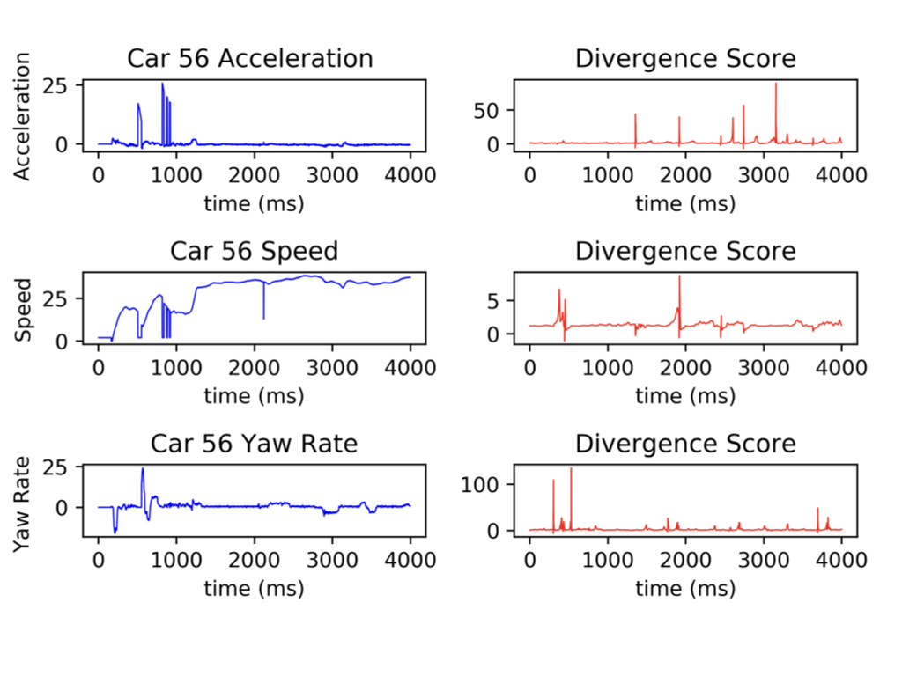
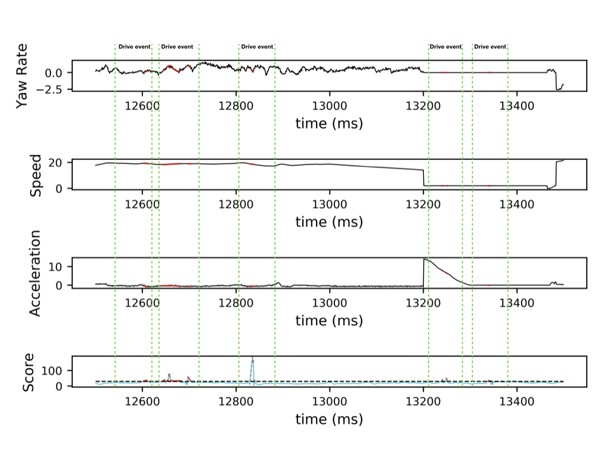
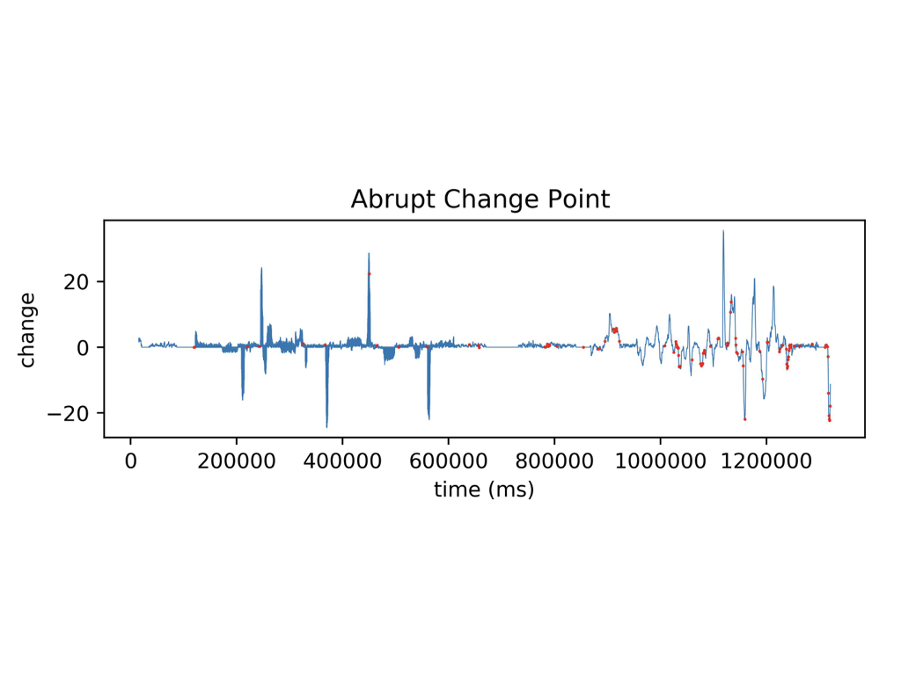
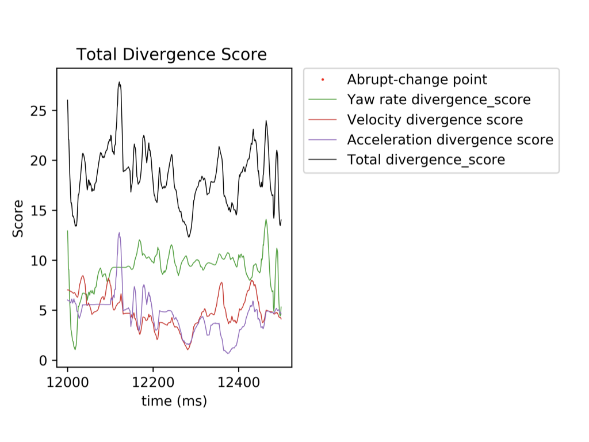
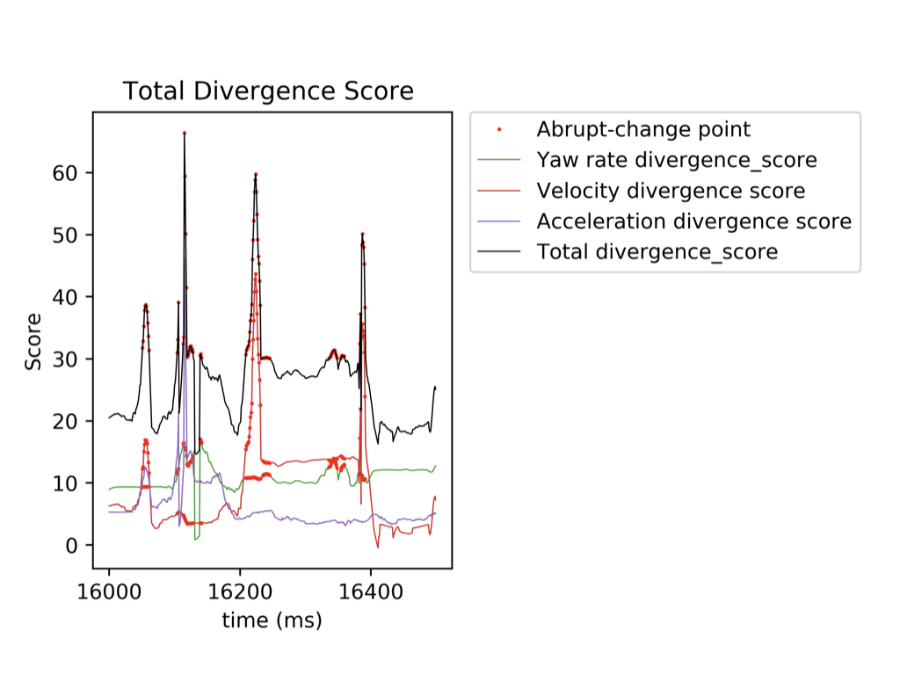

# Rulsif abrupt change detection

using rulsif for abrupt-change detection

# References

[1] Liu S , Yamada M , Collier N , et al. Change-Point Detection in Time-Series Data by Relative Density-Ratio Estimation[J]. 2012.

[2] Kawahara Y , Sugiyama M . Sequential change‐point detection based on direct density‐ratio estimation[M]. John Wiley & Sons, Inc. 2012.

[3] Kawahara Y , Yairi T , Machida K . Change-Point Detection in Time-Series Data Based on Subspace Identification[C]// Data Mining, 2007. ICDM 2007. Seventh IEEE International Conference on. IEEE, 2007.

# Environment
<pre>python=3.6</pre>

# Usage
<pre><code>python apply_main.py </code></pre>

# Introduction

